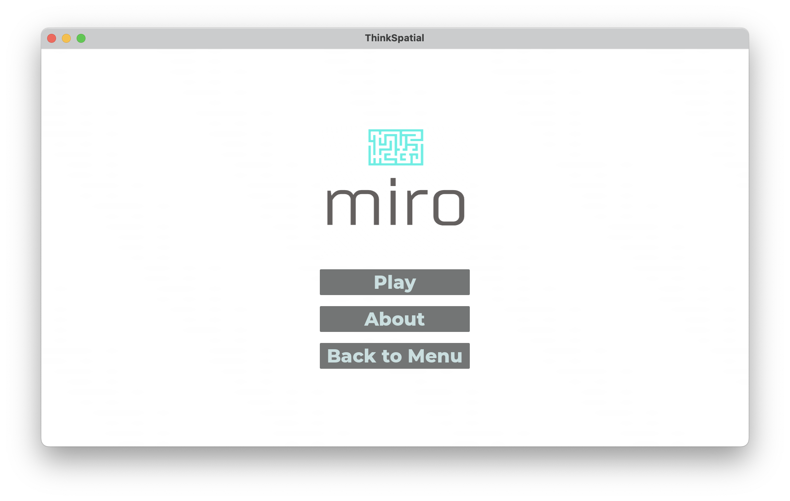

# Chicken Breast


## The Team

**CodeRunner Team**
- Jordan Pisarek
- Jared McDowall

**Game Development Team**
- Jamie Shin
- Sun Lee
- Borim Jang
- Jordan Pisarek
- Kishora Tono

**Database Design**
- Jared McDowall

## Project Information
Our project is split into two parts, implementing a spatial skills test using Moodle, with the CodeRunner plugin, and implementation a prototype spatial skills game using Godot.

CodeRunner will be using traditional methods of spatial skills testing, using questions from studies and other tests. The reasoning behind using CodeRunner is the ease of use and the accessibility behind it as it is used by the tertiary sector. 

The game is a prototype that will be aimed at reinventing spatial skills testing, to make it more fun and engaging. The idea is to be able to test spatial skills without it feeling like a test. 

Most of the group planning and collaboration was done through a shared Google drive. Discussions were held through Discord and in-person.

**Code-Runner Technologies:**
- Moodle
- CodeRunner plugin for Moodle

**Game Technologies:**
- Godot
- Blender

## Installation and Configuration

### ThinkSpatial Game Install

For both **Windows** and **macOS**, follow the below instructions for installing and setting up the game.

The game is stored in the GitHub repository, first you will need to clone the repository using the below command - ensure that you have git installed on your machine.

```
git clone https://github.com/uoa-compsci399-s2-2023/capstone-project-team-32.git
```
Once you have the files on your machine, follow the steps below for your respective operating system.

**Windows**

Then open the `game` folder and open the `windows` folder, then you will see the file name `ThinkSpatial`.Open this file and the game should start running. There is nothing but your Windows machine that is needed, so long as you have a a graphics card installed.

**macOS**

Then open the `game` folder and open the `macOS` folder, then you will see the file name `ThinkSpatial`.Once located, open the file and the game should start running.

## Usage Examples - CodeRunner Quiz
To start the quiz, click the attempt quiz button.


There will be a pop-up informing you of the 60-minute time-limit, click start attempt when ready.


Once clicked, you will then be directed to the start of the quiz.


There are 33 questions, which each new section introduces by an example question that is already done for you. Follow the instructions of the questions and enter the answer into the response field.


You can submit your answer, by clicking the check button. However, there is a penalty for each time you click the check button, and the answer is wrong. Do not click the check button, unless you are sure your answer is correct.


Once you have finished your attempt, then click the submit all button at the end of the quiz. If you do not finish in time, CodeRunner will submit all you have done and mark it automatically.


## Usage Examples - ThinkSpatial Game

Once you open the game on either Windows or macOS, you will see the below screen. You will see multiple objects that you can click on, all object on the counters are minigames, select any that you wish to play. To quit, click the door on the left.


When you click on the objects, you will be taken to the game. There are four games to choose from, and you will see one of the following when entering the game.




The first three games have instructions, although the last one does not. *insert directions*.

## Future Plans

**Database Addition**

We would like to add a database to the game, storing all the data collected within the game. Making it simple for the teacher or admin to access player data and analyse and compare across all players. Thus, we have designed a database that we would like to implement in the future. Allowing for teacher and admin access, with data from each minigame stored in separate tables for each player.

Database design is in the database folder, and everything is included in the [Database file](https://github.com/uoa-compsci399-s2-2023/capstone-project-team-32/tree/main/database). 

**Game Extension**

Due to the complexity of our project, there are many other extensions we would like to implement into the game in the future, that time did not allow us to complete. These include creating a mobile application and studying the effectiveness of the game and alongside the full implementation and integration of the database design.
