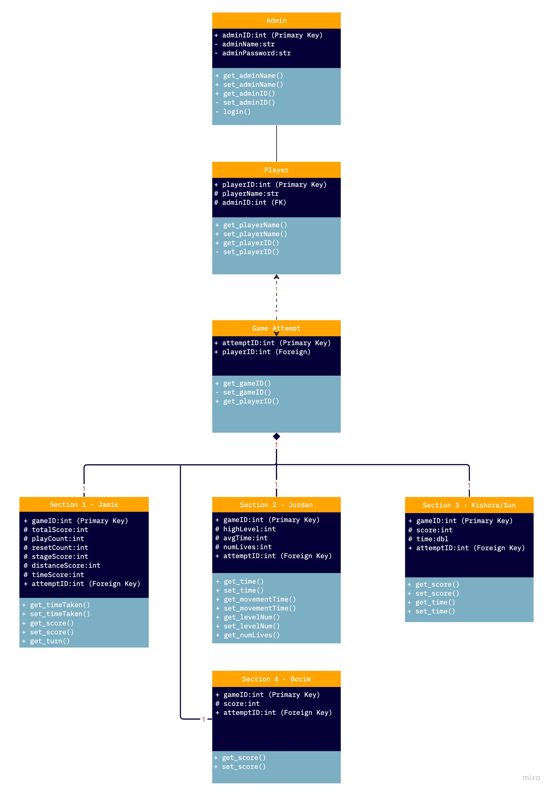
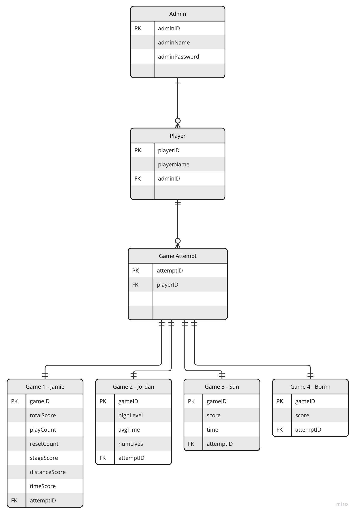

# Team 32 - Game Database

## Database Overview:

### Purpose

The purpose of this document is to outline the design of the databse for the ThinkSpatial game. The reason why we decided to keep it in the design phase, is so that we can focus on the games themselves and have the database as a future implementation. If we had more time, then we would implement the following database design into the game - allowing a secure and accessible place to access player data.

### MVP Outcome

The database will have seven tables in total. There will be one for the admin/teacher. One for the player, this will consist of all the players that have either signed up or played the game. 

There will be a table linked to the player called Game Attempt. This table will hold all the instances that the player has started. From opening up the game to the main menu onwards. This table will link to the minigames, so that for each time the player opens up the main game, there is a new entry in the table. The purpose of this is to keep track of the attempts, and then link to the mini games themselves. 

The last four tables will be used for each section of the game. So there are four sections of the game with each section collecting its own set of data, thus each section must be stored seperately. These sections are targeting different spatial skills, and thus combining into one overall attempt would not be beneficial. These sections will have detailed information about level that the user completes. Although, not all of the sections have levels.

The player can play many games, but a game cannot exist without the player. There is one game for all the four sections, and the sections comprise a part of the overall game. These four sections do not know about each other, there is no need to transfer any data across sections, rather just store the information in the section table with reference to the attemptID.

Currently the purpose of the database is to store data after someone has completed a game. So that the data can then be used elsewhere or evalutated to find the strengths and areas to work on for the player. The game at this stage will run directly on the computers, with a sight to move it to the web and scale up the database to include real time information and so that the game will use the databse rather than session memory - incase something happens before it is able to commit to the database.

### Future Implementation

We would like to include a login service, so that we can be sure that a player is who they say they are, this can be used in schools and universities - using third party authentication like University of Auckland SSO.

Implement the databse design as stipuate in this document, using various technologies. These would include Godot, C#, and AWS.

## Database Design
Below is an overview of the database schema, with a rough idea of what we would want to implement if we had the time.

### Database UML Diagram (Provisional)

### Database ER Diagram (Provisional)

### Database Tables

#### Admin Table
Each admin table has links to certain players, either zero or more.

- adminID:int
    - Primary Key

- adminName:str
    - choosen string name
    - used for authentication

- adminPassword:str
    - chosen password
    - used for authentication

#### Player Table

- playerID:int (Primary Key)
    - a random integer assigned by the database.
    - used for one-to-many relationship with other tables.
- playerName:str (Optional)
    - used to link primary key to a particular player.
    - player gives a string name.
    - without which, players are annoymous and double ups may occur. 
    - Optional until future implementation of login service, have no capacity to force and maintain username yet.
- adminID:int (FK)
    - used to create a link between the player and admin/teacher

Have a table for each game, so four tables and link them through unique ID. All variables that are not used by other tables will be protected and thus not accessible by other classes. There are getter and setter methods, so that the values can be changed appropriately. 

The username will be used to link the key to specific people, as the key is randomly generated, there is no way to be sure who scores what. Implementing a forced username with login credentials is part of the future implementation.

#### Game Table (Attempts)
- attemptID:int
    - PK
    - Each time the player logs in a new attempt is added.
- startDate:dttm
    - when player first started the attempt
- endDate:dttm
    - when the player ended the session (exits)
- playerID:int
    - FK

The game table (attempts by the player) is where all the attempts by the player will be stored. It will store basic information like the attemptID, a link to playerID. The idea with this table is to act like an interface between Player and Game. This way we are able to have many games per player, but also be able to store many levels for each section. Some of the sections in the game have levels to them, some do not. So we need to have a way to store both information from each level per section, then link those to the game attempt. Then the game attempt will be linked to the player.

#### Section 1 (Developed by Jamie)

Jamie's game has three variables that will need to be stored by the database. They are:

- time:dbl
    - time taken to solve the maze.
    - increases incrementally.
- totalScore:int
    - score after solving the maze.
    - made up of multiple different scoring.
    - there are different bonus, like distance and time.
- playCount:int
    - the number of plays/levels
- resetCount:int
    - the number of times the player clicked reset
- stageScore:int
    - the score for each stage
- distanceScore:int
    - bonus score, the score for the amount of distance travelled
- timeScore:int
    - time score
- gameID:int
    - PK
    - each new attempt in the game a new PK is produced
- attemptID:int
    - FK
    - used to link the game to the current session/attempt

The game already has functions to collect the information above, the database just needs to store them. 

#### Section 2 (Developed by Jordan)
Jordan's game has a few more variables that will need to be collected and stored in the database, they differ to Jamie's game.

- highLevel:int
    - the highest level reach by the player in the game
- avgTime:dtttm
    - the average time taken to complete a level
- numLives:int
    - the number of lives remaining
- gameID:int
    - PK
    - each new attempt in the game a new PK is produced
- attemptID:int
    - FK
    - used to link the game to the current session/attempt

Again, Jordan's game has the variables included in the game the database will need to collect and store these variables. 

#### Section 3 (Co-developed by Kishora & Sun) 
This game is being co-developed by Kishora and Sun. This game will only have to variabels in its table:

- gameID:int
    - PK
    - each new attempt in the game a new PK is produced
- score:int
    - the total score from the game..
- time:dbl
    - the total time taken to solve the game.
- attemptID:int
    - FK
    - used to link the game to the current session/attempt

The database will only need to collect and store the data.

#### Section 4 (Developed by Borim) 
Borim's game will only have one vairable that will need to be collected and sotred by the database.

- gameID:int
    - PK
    - each new attempt in the game a new PK is produced
- score:int
    - the total score from solving the game.
- attemptID:int
    - FK
    - used to link the game to the current session/attempt

These will be updated as the games get closer to being finished. We will need to think of further information that can be collected and analysed to give insight into whether people are doing well in one spatial skill and not so in the other.
