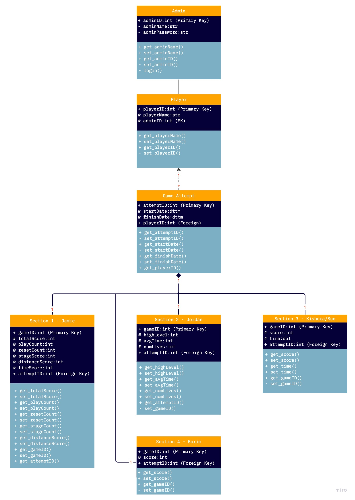

# Team 32 - Game Database

## Database Overview:

**MVP**:
The database will have one table per game, with one extra table for the player. The idea with this approach is so that one player can play different sections of the main game, with data collected and stored seperately, so that we can evaluate the progress made across each section. Then, this could be used to compare the averages across all players per section, as each section is focussed on particular spatial awareness skills. 

The database will be using a one-to-many relationship built on MySQL (RDMS). This will be implemented on the AWS server that we have been setup with.

**Future Implementation**: There could be an opportunity to include a teacher/admin class, allowing the teacher to access all data from the players in a simplified format - only seeing overviews.

Another implementation is to include a login service, so that we can be sure that a player is who they say they are, this can be used in schools and universities - using third party authentication like University of Auckland SSO.

Add functionality for data to be transferred directly from Godot to the server, via C#.

## Database Design
Currently I am still designing the database, but this section indicates what is currently done. A UML diagram, along with descriptions of the games and the variables that they are using.

### Database UML (Provisional)

### Database Tables

#### Player

**Key**: Unique ID given by database.
**Username**: Optional name for player.

Have a table for each game, so four tables and link them through unique ID. All variables that are not used by other tables will be protected and thus not accessible by other classes. There are getter and setter methods, so that the values can be changed appropriately. 

The username will be used to link the key to specific people, as the key is randomly generated, there is no way to be sure who scores what. Implementing a forced username with login credentials is part of the future implementation.

#### Game Section 1 (Developed by Jamie)

Jamie's game has three variables that will need to be stored by the database. They are:

- time:dbl
    - time taken to solve the maze.
    - increases incrementally.
- score:int
    - score after solving the maze.
    - made up of multiple different scoring.
    - there are different bonus, like distance and time.
- turn:int
    - the number of turns taken.
    - increases incrementally.

The game already has functions to collect the information above, the database just needs to store them. 

#### Game Section 2 (Developed by Jordan)
Jordan's game has a few more variables that will need to be collected and sotred in the database, they differ to Jamie's game.

- time:dbl
    - time taken to solve the puzzle.
    - increases.
- movementTime:int
    - tracks how fast a user moves.
    - increases.
- levelNum:int
    - the level that the player got to.
    - increases incrementally.
- numLives:int
    - number of lives that are remaining.
    - decrements.

Again, Jordan's game has the variables included in the game the database will need to collect and store these variables. 

#### Game Section 3 (Co-developed by Kishora & Sun) 
This game is being co-developed by Kishora and Sun. This game will only have to variabels in its table:

- score:int
    - the total score from the game..
- time:dbl
    - the total time taken to solve the game.

The database will only need to collect and store the data.

#### Game Section 4 (Developed by Borim) 
Borim's game will only have one vairable that will need to be collected and sotred by the database.

- score:int
    - the total score from solving the game.

These will be updated as the games get closer to being finished. We will need to think of further information that can be collected and analysed to give insight into whether people are doing well in one spatial skill and not so in the other.